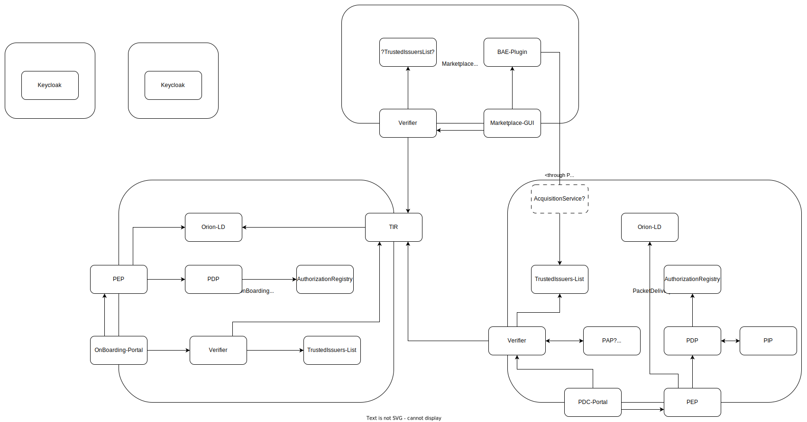

# IAM Documentation Vienna

Temporary repository to collect all documentation in regards to extend the Trust & IAM Framework as planned for the summit in Vienna.

* Board: [Kanban IAM for Vienna](https://tree.taiga.io/project/wistefan-iam-for-vienna/kanban)

Component repositories:
* [Keyclock-VC-Issuer](https://github.com/wistefan/keycloak-vc-issuer)
* [Orion-LD](https://github.com/FIWARE/context.Orion-LD)
* [TrustedIssuersRegistryWrapper](https://github.com/pulledtim/trusted-issuer-registry-wrapper)
* [DSBA-PDP](https://github.com/FIWARE/dsba-pdp)
* [Keyrock](https://github.com/ging/fiware-idm)
* [Verifier](https://github.com/FIWARE/VCVerifier)
* [Portal](https://github.com/i4Trust/pdc-portal)
* [PEP-Plugin](https://github.com/FIWARE/kong-plugins-fiware)
* [Business-API-Ecosystem](https://github.com/FIWARE-TMForum/Business-API-Ecosystem)
* [BAE-Plugin](https://github.com/i4Trust/bae-i4trust-service)
* [Activation Service](https://github.com/i4Trust/activation-service)
* [Demo-Wallet](https://github.com/FIWARE/VCWallet)
* [WaltId SsiKit](https://github.com/walt-id/waltid-ssikit)
* [FIWARE Helm Charts](https://github.com/FIWARE/helm-charts)
* [i4Trust Helm Charts](https://github.com/i4Trust/helm-charts)

Example deployments:
* [Gaia-X OnBoarding Setup](https://github.com/FIWARE-Ops/fiware-gitops/tree/master/aws/gaia-x)
* [i4Trust Demonstrator](https://github.com/FIWARE-Ops/i4trust-demonstrator)

Additional documentation and specs:
* [W3C did:web](https://w3c-ccg.github.io/did-method-web/)
* [SIOP-2](https://openid.net/specs/openid-connect-self-issued-v2-1_0.html)
* [OIDC4VP](https://openid.net/specs/openid-4-verifiable-presentations-1_0.html)
* [OIDC4VCI](https://openid.net/specs/openid-4-verifiable-credential-issuance-1_0.html)
* [DOME Reference Archtiecture](https://docs.google.com/document/d/1xqnWsh9pWYfLtR6tkLBXFYKZGdBZhKl8u7t8Padwp7M/edit)
* [i4Trust Building Blocks](https://github.com/i4Trust/building-blocks)
* [iShare Spec](https://dev.ishare.eu/index.html)
* [Gaia-X Trust Framework](https://gaia-x.gitlab.io/technical-committee/architecture-document//identity_credentials_access_management/)
* [Gaia-X Repo](https://gitlab.com/gaia-x/lab/compliance)
* [Gaia-X Compliance Service](https://compliance.lab.gaia-x.eu/development/docs/#/Common/CommonController_issueVC)
* [Gaia-X Registry](https://registry.lab.gaia-x.eu/development/docs/#/ComplianceIssuers/ComplianceIssuersController_findAll)
* [EUDI Wallet Refernce Architecture](https://digital-strategy.ec.europa.eu/en/library/european-digital-identity-wallet-architecture-and-reference-framework)
* [EBSI Trusted Issuers Registry](https://api-pilot.ebsi.eu/docs/apis/trusted-issuers-registry/latest#/)
* [WaltID REST Api's](https://docs.walt.id/v/ssikit/getting-started/rest-apis/)
* [Tech-X Challenge Doc](https://github.com/FIWARE-Ops/tech-x-challenge)